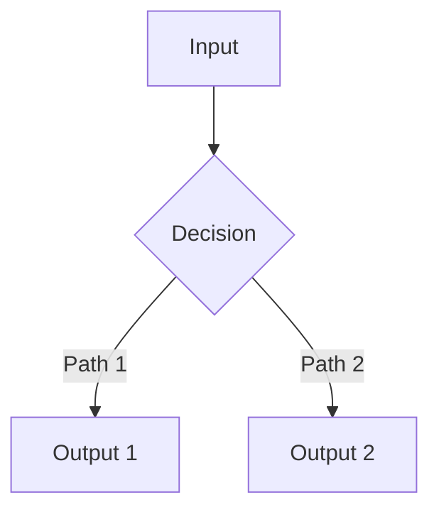

# Update PR Description

Generate a comprehensive PR description for an existing PR based on the changes in the branch.

## Gather Context

First, run these commands to understand the changes:

```bash
# Check current branch and PR
git branch --show-current
gh pr view --json number,title,url

# Understand the scope of changes
git log main..HEAD --oneline
git diff main..HEAD --stat

# Review the actual changes
git diff main..HEAD
```

## PR Description Template

Generate a description following this structure:

```markdown
## What am I trying to do?

[1-3 sentences explaining the high-level goal. Focus on the problem being solved, not the implementation details.]

## Why did I do it this way?

[Explain key design decisions. Include subsections if there are multiple important choices:]

### [Decision 1 Name]
[Explanation with code snippets if helpful]

### [Decision 2 Name]
[Explanation]

## Are there any tests?

[Describe test coverage:]
- **Unit tests** (`test_file.py`): [what's tested]
- **Integration tests** (`test_integration.py`): [what's tested]

## How would I use the new code?

[Provide concrete examples:]

```bash
# Example command or API call
curl "/api/endpoint?param=value"
```

```python
# Example code usage
result = my_function(arg1, arg2)
```

## Architecture (optional)

[Include a Mermaid diagram for multi-component changes:]



🤖 Generated with [Claude Code](https://claude.ai/code)
```

## Writing Guidelines

1. **Be specific** - Reference actual file names, function names, and line numbers
2. **Explain the "why"** - Don't just describe what changed, explain why you chose this approach
3. **Include code snippets** - Show before/after or example usage where helpful
4. **Use diagrams** - Mermaid diagrams help visualize flows and relationships
5. **Keep it scannable** - Use headers, bullet points, and code blocks

## Updating the PR

### For Netflix repos (git.netflix.net proxy)

```bash
# Fix proxy first
ghe-fix-proxy $(pwd) --verify

# Update the PR description
gh pr edit --body "$(cat <<'EOF'
[your description here]
EOF
)"

# Reset proxy when done
ghe-fix-proxy --reset
```

### For standard GitHub repos

```bash
gh pr edit --body "$(cat <<'EOF'
[your description here]
EOF
)"
```

## Tips

- Read the existing PR description first with `gh pr view --json body`
- Look at recent commits to understand the evolution of changes
- If the PR has multiple commits, organize the description to cover all changes cohesively
- For refactoring PRs, emphasize what stayed the same (behavior) vs what changed (structure)
