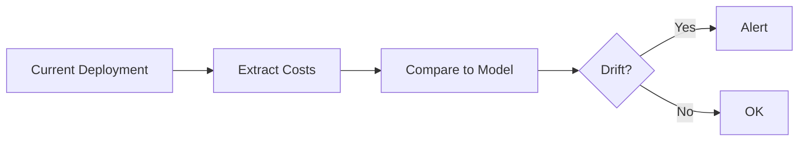

# Update PR Description

> **Related skills:**
> - `/create-nflx-pr` - Create a new PR (if PR doesn't exist yet)
> - `/commit-push-pr` - Commit, push, and create PR in one workflow
> - `/address-comments-by <reviewer>` - Address review comments

Generate a comprehensive PR description for an existing PR based on the changes in the branch.

## Gather Context

First, run these commands to understand the changes:

```bash
# Check current branch and PR
git branch --show-current
gh pr view --json number,title,url

# Understand the scope of changes
git log main..HEAD --oneline
git diff main..HEAD --stat

# Review the actual changes
git diff main..HEAD
```

## PR Description Template

Generate a description following this structure:

```markdown
## What am I trying to do?

[1-3 sentences explaining the high-level goal. Focus on the problem being solved, not the implementation details.]

## Why did I do it this way?

[Explain key design decisions. Include subsections if there are multiple important choices:]

### [Decision 1 Name]
[Explanation with code snippets if helpful]

### [Decision 2 Name]
[Explanation]

## Are there any tests?

[Focus on WHAT the tests prove, not a list of test names. 1-2 sentences max:]

- Good: "Yes - regression tests verify costs stay within ±5% when model logic changes."
- Good: "Added property tests that catch edge cases the original unit tests missed."
- Bad: "test_foo tests foo, test_bar tests bar, test_baz tests baz..."

## How would I use the new code?

[Provide concrete examples:]

```bash
# Example command or API call
curl "/api/endpoint?param=value"
```

```python
# Example code usage
result = my_function(arg1, arg2)
```

## Architecture (only if needed)

**Include a diagram ONLY if ONE of these is true:**
1. **Data flows through 3+ components** - Show the pipeline
2. **There's a non-obvious ordering/dependency** - Show what must happen first
3. **State changes in surprising ways** - Show before/after states
4. **The text explanation exceeds 5 sentences** - A picture is worth 1000 words

**Skip the diagram if:**
- It just restates what the code already shows
- It's a simple A→B→C that's obvious from the function calls
- You're adding it "because PRs should have diagrams"

**Diagram style rules:**
- **Plain English labels** - not code (`"Get user's orders"` not `getUserOrders()`)
- **Big abstract boxes** - hide implementation details
- **3-6 boxes max** - more means too much detail
- **Readable without code context** - a PM should understand it



🤖 Generated with [Claude Code](https://claude.ai/code)
```

## Writing Guidelines

1. **Explain the "why"** - Don't just describe what changed, explain why you chose this approach
2. **Be concise** - If a section doesn't add value, skip it
3. **Code snippets > prose** - Show, don't tell
4. **Scannable** - Headers, bullets, tables. Walls of text = unread

## Updating the PR

### For Netflix repos (git.netflix.net proxy)

**Use `gh api` with explicit hostname** (not `gh pr edit` which doesn't reliably detect the host):

```bash
# Fix proxy first
ghe-fix-proxy $(pwd) --verify

# Find the PR number (replace org/repo with actual path, e.g., corp/cde-cdemkdocs)
gh api --hostname github.netflix.net repos/{org}/{repo}/pulls \
  --jq '.[] | select(.head.ref == "YOUR_BRANCH") | {number, title}'

# Update the PR description
gh api --hostname github.netflix.net -X PATCH repos/{org}/{repo}/pulls/{PR_NUMBER} \
  -f body="$(cat <<'EOF'
[your description here]
EOF
)"

# Reset proxy when done
ghe-fix-proxy --reset
```

**Important:**
- Use the full PR Description Template above - do not abbreviate
- The repo path in the API may differ from git remote (e.g., `cde/repo` → `corp/cde-repo`)

### For standard GitHub repos

```bash
gh pr edit --body "$(cat <<'EOF'
[your description here]
EOF
)"
```

## Tips

- Read the existing PR description first with `gh pr view --json body`
- Look at recent commits to understand the evolution of changes
- If the PR has multiple commits, organize the description to cover all changes cohesively
- For refactoring PRs, emphasize what stayed the same (behavior) vs what changed (structure)
